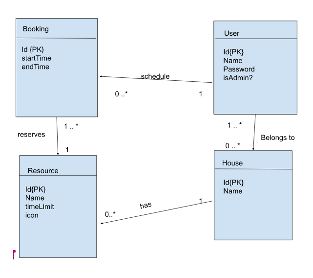
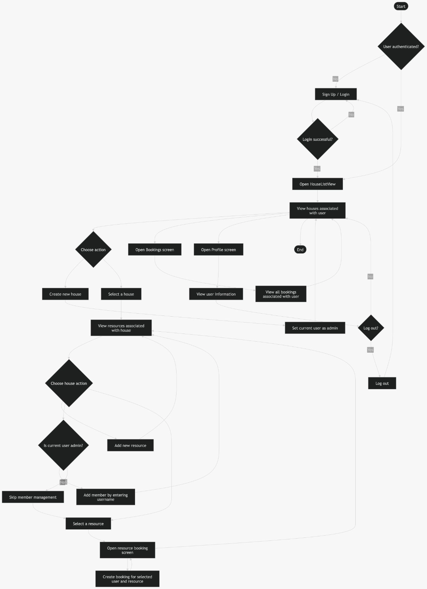

CS 5200 : DBMS

---

### Project Group Information

Group name : SonawaneARajendraR

Group members

- Atharva Sonawane
- Rohan Rajendra

---

### Description

The application would allow housemates to schedule and reserve resources (like the kitchen or the washer/dryer) that can be used in a shared home such as student accommodation. 

---

### Description of the Data Model

A group of housemates living in shared accommodation want a system that allows them to schedule and reserve shared household resources such as kitchens, bathrooms, laundry machines, appliances, the TV, and more. These resources are often in high demand during certain times, and the housemates need a fair and organised way to manage access to the resources. The application stores information about the people using the system, the houses they belong to, the resources available in each house, and the bookings made for those resources.

A user represents a person living in a shared home. Each user has a unique identifier, a name, and a password. A user belongs to 0 to many houses, and each house must have 1 to many users (many‑to‑many relationship). Users also create bookings for resources, and a user may have many bookings over time. A house has one user who is the admin, the admin manages the users association to a house. 

A house represents a shared living unit such as an apartment or student housing. Each house has a unique identifier and a name. A house contains the resources that its residents can reserve. A house may have zero to many resources associated with it and a resource is is associated to exactly one house 
(Note: While a typical house must have at least some resources. The resources we are concerned with here are the shared resources, hence the participation constraint is optional. )

A resource represents a reservable item within a house, such as a kitchen, bathroom, laundry machines, TV, or appliances or any other custom resource that is defined by the users. Each resource has a unique identifier and a name, and it belongs to exactly one house. A resource may have many bookings.  A resource has a time limit which specifies the maximum allowed booking duration for that resource type, and an icon to identify the resource in the user interface. 

A booking represents a reservation made by a user for a specific resource. Each booking has a unique identifier, a start time, and an end time. A booking scheduled by exactly one user while a user can have one to many bookings. A booking is associated with exactly one resource and a resource has one to many bookings. 

---

### Storage Choice

The project will use MySQL, a relational SQL database.

---

### Software and Languages

- Programming Language: Python 3.x
- API Framework: FastAPI
- Interface: Web application
- FrontEnd ReactJs

---

### Data Domain Motivation

Shared spaces are often a spot for lots of conflict and disagreements over who has a claim over a particular space or resource at a given moment. These problems are often made worse when all the members of the shared space have similar schedules. Having a system that organises the scheduling of these resources can help minimise conflict. This data domain is from lived experiences. Having verbal agreements over resource scheduling is not maintainable or scalable. A well defined system would help harmonise living spaces. 

---

### Conceptual Design

---

### User Interaction Flow

- User signs up or logs in.
- Upon login, the **HouseListView** displays all houses associated with the user.
- User may:
    - Create a new house (becoming its admin), or
    - Select an existing house to view its resources.
- Within a house, the user can:
    - View resources
    - Add new resources (if admin)
    - Add new members by entering their username (admin only)
- Selecting a resource opens the **Resource Booking** screen.
- User creates a booking for the selected resource.
- User may also view all their bookings in the **Bookings** screen.
- The **Profile** screen displays user information and includes a logout option.

---

### Flowchart

